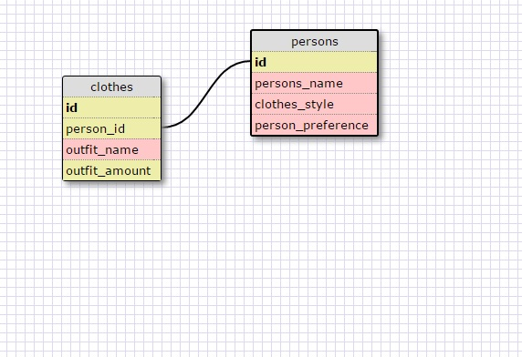

1. SELECT * FROM states;

2. SELCT * FROM regions;

3. SELECT state_name, population FROM states;

4. SELECT state_name, population FROM states ORDER BY population DESC;

5. SELECT state_name FROM states WHERE region_id LIKE 7

6. SELECT state_name, population_density FROM states WHERE population_density > 50 ORDER BY population_density;

7. SELECT state_name FROM states WHERE population BETWEEN 1000000 AND 1500000;

8. SELECT state_name, region_id FROM states ORDER BY region_id;

9. SELECT region_name FROM regions WHERE region_name LIKE '%Central%';

10. SELECT region_name,state_name FROM states JOIN regions WHERE states.region_id = regions.id ORDER BY region_id;

What are databases for?
Databases are used to store huge amounts of data. So huge that you would not want to store it in arrays or hashses.

What is a one-to-many relationship?
You can identify a one-to-many relationship using the phrases "____ belongs to a ____. ____ has many ____." Because these two things have a one-to-many relationship, it makes far more sense to separate them into two tables.

What is a primary key? What is a foreign key? How can you determine which is which?
A primary key, also called a primary keyword, is a key in a relational database that is unique for each record. A foreign key is a field (or collection of fields) in one table that uniquely identifies a row of another table. If there is a reference from one table to abother then that is a foreign key, if it is only unique to its own table then it is a primary key.

How can you select information out of a SQL 
database? What are some general guidelines for that?
You can select them from the columns given from the databases. You can use that information by mixing up and getting results on what you selected.
