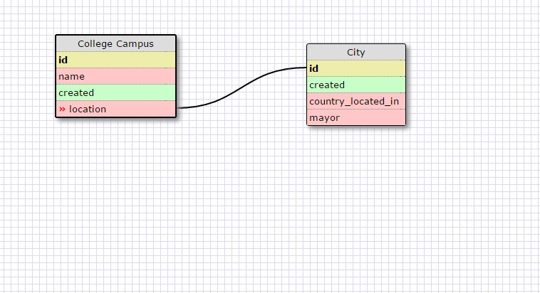
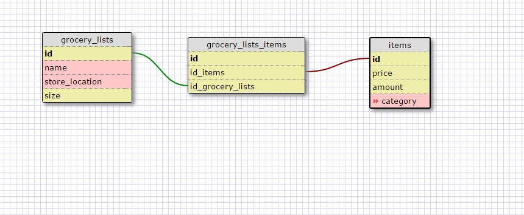

What is a one-to-one database?
One-to-one relationships are used when two things have a single relationship to one another. Essentially, they are a pair.

When would you use a one-to-one database? (Think generally, not in terms of the example you created)
In general, when a there is one characteristic that is shared between two columns.

What is a many-to-many database?
Many-to-many relationships are common and relatively easy to understand in principle although they are more difficult to implement in practice. To model a many-to-many relationship, two distinct tables are connected by a join table.

When would you use a many-to-many database? (Think generally, not in terms of the example you created).
You would use a many-to-many when the tables have mulitple uses that can be used.

What is confusing about database schemas? What makes sense?
What is confusing is splitting everything up into different tables and connecting them when they can share a characteristic. What make sense is the use of tables and databases in general to store large amounts of data.
